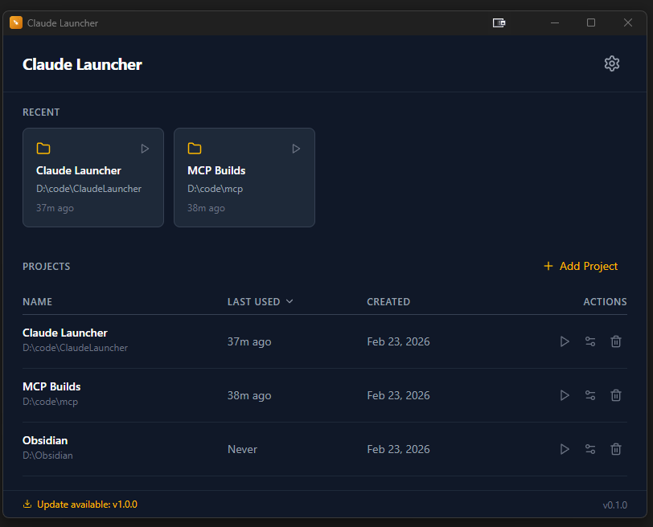

<p align="center">
  
</p>

<h1 align="center">Claude Launcher</h1>

<p align="center">
  A desktop app for launching <a href="https://docs.anthropic.com/en/docs/claude-code">Claude Code CLI</a> from different project directories with configurable flags.
</p>

<p align="center">
  Built with Tauri v2 &bull; React &bull; TypeScript &bull; Rust
</p>

---

<p align="center">
  
</p>

<p align="center">
  
</p>

## Features

- **Project Management** &mdash; Add, organize, and launch Claude Code sessions for multiple project directories
- **Recent Projects** &mdash; Quick-access cards for your most recently used projects
- **Configurable Flags** &mdash; Toggle built-in flags (`--dangerously-skip-permissions`, `--verbose`) or add custom flags
- **Per-Project Overrides** &mdash; Override global flag settings on a per-project basis (Global / On / Off)
- **Auto-Detect Claude** &mdash; Automatically finds the Claude CLI executable on your system
- **Terminal Integration** &mdash; Launches via Windows Terminal with configurable profile, with PowerShell fallback
- **Launch Logging** &mdash; Built-in log viewer with full audit trail of all launch attempts
- **Update Checker** &mdash; Automatically checks GitHub for new releases on startup; shows a download link in the status bar
- **Persistent Settings** &mdash; All data saved locally via JSON store

## Prerequisites

- **Windows 10/11** (currently Windows-only)
- **[Claude Code CLI](https://docs.anthropic.com/en/docs/claude-code)** installed and accessible from your PATH
- **[Windows Terminal](https://aka.ms/terminal)** (recommended, falls back to PowerShell)

## Installation

Download the latest installer from the [Releases](https://github.com/arris138/Claudelauncher/releases) page:

- **NSIS Installer** (recommended): `Claude Launcher_x.x.x_x64-setup.exe`
- **MSI Installer**: `Claude Launcher_x.x.x_x64_en-US.msi`

## Usage

1. **Add a project** &mdash; Click the "+" button, give it a name, and browse to the project directory
2. **Configure flags** &mdash; Open Settings to toggle global flags or add custom ones
3. **Launch** &mdash; Click the play button on any project to open Claude Code in that directory
4. **Per-project flags** &mdash; Click the flag icon on a project to override global settings for that project

## Building from Source

### Requirements

- [Node.js](https://nodejs.org/) (v18+)
- [pnpm](https://pnpm.io/)
- [Rust](https://rustup.rs/) (stable)
- [Tauri v2 prerequisites](https://v2.tauri.app/start/prerequisites/)

### Development

```bash
pnpm install
pnpm tauri dev
```

### Production Build

```bash
pnpm tauri build
```

Build outputs:
| Type | Location |
|------|----------|
| Portable exe | `src-tauri/target/release/claude-launcher.exe` |
| NSIS installer | `src-tauri/target/release/bundle/nsis/Claude Launcher_1.0.0_x64-setup.exe` |
| MSI installer | `src-tauri/target/release/bundle/msi/Claude Launcher_1.0.0_x64_en-US.msi` |

### Regenerating Icons

```bash
# Requires @resvg/resvg-js (install temporarily if needed)
node scripts/convert-icon.mjs

# Or use Tauri's built-in generator from a 1024x1024 PNG:
pnpm tauri icon app-icon.png
```

## Architecture

```
src/                          # React frontend (TypeScript)
├── components/               # UI components
│   ├── Layout.tsx            # Main layout wrapper
│   ├── TitleBar.tsx          # Top navigation bar
│   ├── StatusBar.tsx         # Version display & update notification
│   ├── ProjectList.tsx       # Sortable project table
│   ├── RecentCards.tsx       # Recent project quick-access cards
│   ├── AddProjectDialog.tsx  # Add project modal
│   ├── SettingsModal.tsx     # Global settings (General + Logs tabs)
│   └── ProjectFlagsModal.tsx # Per-project flag overrides
├── hooks/
│   ├── useProjects.ts        # Project CRUD, sorting, recent tracking
│   ├── useSettings.ts        # Global settings & flag management
│   └── useUpdateChecker.ts   # GitHub release update checker
├── services/
│   ├── launcher.ts           # Tauri command invocation for launching
│   ├── store.ts              # Persistent JSON store wrapper
│   └── log.ts                # Log access service
├── utils/
│   ├── flags.ts              # Flag resolution (global + overrides)
│   └── dateFormat.ts         # Relative time formatting
└── App.tsx                   # Root component

src-tauri/                    # Rust backend
├── src/lib.rs                # Tauri commands (launch_claude, detect_claude_path, logging)
├── tauri.conf.json           # Tauri configuration
└── Cargo.toml                # Rust dependencies
```

## Tech Stack

| Layer | Technology |
|-------|-----------|
| Desktop Framework | [Tauri v2](https://v2.tauri.app/) |
| Frontend | [React 19](https://react.dev/) + [TypeScript 5.6](https://www.typescriptlang.org/) |
| Build Tool | [Vite 6](https://vite.dev/) |
| Styling | [Tailwind CSS v4](https://tailwindcss.com/) |
| Icons | [Lucide React](https://lucide.dev/) |
| Backend | [Rust](https://www.rust-lang.org/) (2021 edition) |
| Package Manager | [pnpm](https://pnpm.io/) |

## License

This project is licensed under the MIT License. See [LICENSE](LICENSE) for details.
